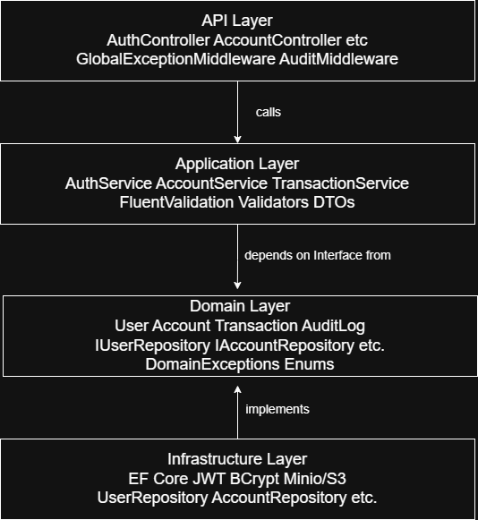

# SecureVault API


A production-grade banking API built with **ASP.NET Core 10** following 
**Clean Architecture** principles. Simulates core retail banking operations 
including account management, financial transactions, JWT authentication, 
AWS S3 document storage, audit logging, and rate limiting.

> Built as a portfolio project to demonstrate Senior/.NET Lead level 
> engineering practices in a regulated banking domain.

---

## Architecture



The solution is divided into four layers following Clean Architecture principles.
Dependencies point inward only — Domain knows nothing about EF Core or AWS.

| Layer | Project | Responsibility |
|---|---|---|
| Domain | `SecretVault.Domain` | Entities, interfaces, exceptions, enums. Zero framework dependencies. |
| Application | `SecretVault.Application` | Use cases, DTOs, validators, service interfaces. Depends on Domain only. |
| Infrastructure | `SecretVault.Infrastructure` | EF Core, repositories, JWT, BCrypt, Minio/S3. Implements Application interfaces. |
| API | `SecretVault.API` | Controllers, middleware, DI composition root. Depends on all layers. |

**Key principle:** `AuthService` in Application depends on `IUserRepository` 
(Domain interface) — not `UserRepository` (Infrastructure class).All SQL Server and EF Core concerns are
contained entirely within Infrastructure. Application and Domain have
no knowledge of how or where data is stored.

---

## Features

- **JWT Authentication** — HS256 signed access tokens (15 min expiry) with 
  refresh token rotation. Refresh tokens hashed with SHA-256 before storage — 
  a DB breach does not expose valid tokens.
- **Account Management** — Create Savings/Checking accounts with unique 
  auto-generated 10-digit account numbers. Ownership enforced on every request.
- **Financial Transactions** — Deposit, withdraw, and transfer with full 
  business rule enforcement. Transfers are atomic — debit and credit wrapped 
  in a single database transaction.
- **AWS S3 Statements** — Monthly account statements generated and uploaded 
  to S3 (Minio locally). Pre-signed download URLs returned with 5-minute expiry. 
  Re-requesting the same month skips re-upload.
- **Audit Logging** — Every write operation automatically logged via middleware. 
  Captures UserId, Action, EntityType, IPAddress, Timestamp. No service or 
  controller knows it is being audited.
- **Global Error Handling** — All domain exceptions mapped to structured HTTP 
  responses via middleware. Stack traces never exposed to clients. Full exception 
  details logged internally via Serilog.
- **Rate Limiting** — IP-based rate limiting on auth endpoints. Max 10 
  requests/minute. Returns 429 with Retry-After header.
- **28 Unit Tests** — xUnit + Moq targeting Application layer only. 
  Zero infrastructure dependencies in tests. All tests run in under 2 seconds.

---

## Tech Stack

| Technology | Version | Purpose |
|---|---|---|
| ASP.NET Core | 10.0 | Web API framework |
| C# | 13 | Primary language |
| Entity Framework Core | 10.0 | ORM + Code First migrations |
| SQL Server LocalDB | 2022 | Primary database |
| JWT Bearer | — | Authentication |
| BCrypt.Net-Next | — | Password hashing (work factor 12) |
| FluentValidation | — | Request validation |
| Minio | — | Local S3-compatible object storage |
| Scalar | — | API documentation |
| Serilog | — | Structured logging to console + file |
| AspNetCoreRateLimit | — | IP-based rate limiting |
| xUnit | — | Unit testing framework |
| Moq | — | Mocking framework |
| FluentAssertions | — | Test assertion library |
| Docker | — | Minio container |

---

## Getting Started

### Prerequisites

- [.NET 10 SDK](https://dotnet.microsoft.com/download)
- SQL Server LocalDB (included with Visual Studio 2022)
- [Docker Desktop](https://www.docker.com/products/docker-desktop)

### 1. Clone the repository
```bash
git clone https://github.com/srirakshathirumali/SecretVault.git
cd SecretVault
```

### 2. Start Minio (local S3)
```bash
docker run -d \
  --name minio \
  -p 9000:9000 \
  -p 9001:9001 \
  -e MINIO_ROOT_USER=minioadmin \
  -e MINIO_ROOT_PASSWORD=minioadmin \
  quay.io/minio/minio server /data --console-address ":9001"
```

Minio console available at `http://localhost:9001` — login with `minioadmin / minioadmin`.

### 3. Configure appsettings

Copy the template:
```bash
cp src/SecretVault.API/appsettings.Development.template.json \
   src/SecretVault.API/appsettings.Development.json
```

`appsettings.Development.json` requires:
```json
{
  "S3": {
    "BucketName": "securevault-statements",
    "Endpoint": "localhost",
    "Port": "9000",
    "AccessKey": "minioadmin",
    "SecretKey": "minioadmin"
  }
}
```

### 4. Run migrations
```bash
dotnet ef database update \
  --project src/SecretVault.Infrastructure \
  --startup-project src/SecretVault.API
```

### 5. Run the API
```bash
dotnet run --project src/SecretVault.API
```

API documentation available at: `https://localhost:7290/scalar/v1`

### 6. Authenticate in Scalar

1. Call `POST /api/auth/register` to create a user
2. Call `POST /api/auth/login` to get your JWT token
3. Click the **Authenticate** button in Scalar UI
4. Paste the `accessToken` value
5. All protected endpoints now work

---

## API Endpoints

### Auth — public

| Method | Endpoint | Description |
|---|---|---|
| POST | `/api/auth/register` | Register a new user |
| POST | `/api/auth/login` | Login — returns JWT access + refresh token |


### Accounts — JWT required

| Method | Endpoint | Description |
|---|---|---|
| POST | `/api/accounts` | Create Savings (0) or Checking (1) account |
| GET | `/api/accounts` | List all accounts for authenticated user |
| GET | `/api/accounts/{id}` | Get account details by ID |
| GET | `/api/accounts/{id}/statement` | Get pre-signed S3 statement URL (5 min expiry) |

### Transactions — JWT required

| Method | Endpoint | Description |
|---|---|---|
| POST | `/api/transactions/deposit` | Deposit into account |
| POST | `/api/transactions/withdraw` | Withdraw from account (max $10,000) |
| POST | `/api/transactions/transfer` | Transfer between accounts (atomic) |
| GET | `/api/transactions/{accountId}` | Get transaction history (newest first) |

### Audit — Admin role required

| Method | Endpoint | Description |
|---|---|---|
| GET | `/api/audit/logs` | Get all audit log entries |

---

## Business Rules

| Rule | Behaviour |
|---|---|
| Insufficient balance | Withdraw/transfer fails with `409 INSUFFICIENT_FUNDS` |
| Self-transfer | Returns `422 UNPROCESSABLE_ENTITY` |
| Account ownership | Accessing another user's account returns `403 FORBIDDEN` |
| Max withdrawal | Single withdrawal capped at `$10,000` — `400` if exceeded |
| Max transfer | Single transfer capped at `$10,000` — `400` if exceeded |
| Minimum amount | All amounts must be greater than `$0.01` |
| Rate limiting | Auth endpoints: max 10 requests/minute per IP — `429` if exceeded |

---

## Error Response Format

All errors return a consistent JSON envelope — stack traces are never exposed:
```json
{
  "status": 409,
  "errorCode": "INSUFFICIENT_FUNDS",
  "message": "Account balance is insufficient for this transaction.",
  "timestamp": "2026-04-01T10:00:00Z"
}
```

| HTTP Code | Error Code | Cause |
|---|---|---|
| 400 | `VALIDATION_ERROR` | FluentValidation failure |
| 401 | `INVALID_CREDENTIALS` | Wrong email or password |
| 403 | `FORBIDDEN` | Account belongs to different user |
| 404 | `NOT_FOUND` | Account or resource not found |
| 409 | `EMAIL_EXISTS` | Duplicate email on registration |
| 409 | `INSUFFICIENT_FUNDS` | Balance too low for transaction |
| 422 | `INVALID_OPERATION` | Self-transfer attempted |
| 429 | `RATE_LIMITED` | Too many requests from same IP |
| 500 | `INTERNAL_ERROR` | Unhandled server exception |

---

## Design Decisions

**Why Clean Architecture?**
Domain has zero framework dependencies. All SQL Server and EF Core concerns are
contained entirely within Infrastructure. The 
Application layer never imports EF Core — it only knows about 
`IUserRepository` and `IAccountRepository` interfaces defined in Domain.

**Why Code First over Database First?**
Domain model is the single source of truth. Schema is a persistence detail 
that follows from the domain — not the other way around. EF Core migrations 
track schema evolution as version-controlled C# code.

**Why refresh token rotation?**
On each refresh the old token is invalidated and a new one issued. Refresh 
tokens are hashed with SHA-256 before storage — a database breach does not 
expose valid tokens. The raw token is returned to the client only once.

**Why Minio for local S3 development?**
Minio is fully S3-compatible — the same code runs against Minio locally and 
real AWS in production. Local dev never points at production cloud resources. 
Switching to real AWS is a single DI registration change — Application layer 
is completely unaffected.

**Why middleware for audit logging?**
Audit logging is a cross-cutting concern. Implementing it in middleware means 
no service or controller knows it is being audited. `AuthService` does not 
import `IAuditLogRepository` — the concern is separated at the infrastructure 
boundary. Method injection on `InvokeAsync` handles the scoped/singleton 
lifetime correctly.

**Why method injection in AuditMiddleware?**
Middleware is singleton. `IAuditLogRepository` is scoped. Injecting a scoped 
service into a singleton constructor creates a captive dependency — the 
DbContext is never disposed and holds a connection open forever. Method 
injection resolves the repository fresh from the request scope on each call.

---

## Running Tests
```bash
dotnet test --verbosity normal
```
```
Passed! — Failed: 0, Passed: 28, Skipped: 0
```

| Test File | Coverage |
|---|---|
| `AuthServiceTests.cs` | Registration, login, duplicate email, wrong password, password hashing |
| `AccountServiceTests.cs` | Account creation, ownership enforcement, balance operations |
| `TransactionServiceTests.cs` | Deposit, withdraw, transfer, insufficient funds, self-transfer |

All tests mock infrastructure via Moq — no database, no HTTP, no JWT library required.
Application layer is fully testable in isolation.

---

## Project Structure
```
SecretVault/
├── src/
│   ├── SecretVault.API/
│   │   ├── Controllers/
│   │   │   ├── AccountController.cs
│   │   │   ├── AuditController.cs
│   │   │   ├── AuthController.cs
│   │   │   └── TransactionController.cs
│   │   ├── Middleware/
│   │   │   ├── AuditMiddleware.cs
│   │   │   └── GlobalExceptionMiddleware.cs
│   │   ├── Models/
│   │   │   └── ErrorResponse.cs
│   │   ├── logs/
│   │   ├── Program.cs
│   │   └── appsettings.json
│   ├── SecretVault.Application/
│   │   ├── DTOs/
│   │   │   ├── Account/
│   │   │   ├── Auth/
│   │   │   └── Transaction/
│   │   ├── Interfaces/
│   │   │   ├── IAccountService.cs
│   │   │   ├── IAuthService.cs
│   │   │   ├── IJwtService.cs
│   │   │   ├── IPasswordService.cs
│   │   │   └── IS3Service.cs
│   │   ├── Services/
│   │   │   ├── AccountService.cs
│   │   │   ├── AuthService.cs
│   │   │   └── TransactionService.cs
│   │   ├── Validators/
│   │   └── DependencyInjection.cs
│   ├── SecretVault.Domain/
│   │   ├── Entities/
│   │   │   ├── Account.cs
│   │   │   ├── AuditLog.cs
│   │   │   ├── BaseEntity.cs
│   │   │   ├── Transaction.cs
│   │   │   └── User.cs
│   │   ├── Enums/
│   │   │   ├── AccountType.cs
│   │   │   ├── TransactionType.cs
│   │   │   └── UserRole.cs
│   │   ├── Exceptions/
│   │   └── Interfaces/
│   │       ├── IAccountRepository.cs
│   │       ├── IAuditLogRepository.cs
│   │       ├── ITransactionRepository.cs
│   │       └── IUserRepository.cs
│   └── SecretVault.Infrastructure/
│       ├── Persistence/
│       │   ├── Migrations/
│       │   ├── Repositories/
│       │   ├── AppDbContext.cs
│       │   └── AppDbContextFactory.cs
│       ├── Services/
│       │   ├── JwtService.cs
│       │   ├── PasswordService.cs
│       │   └── S3Service.cs
│       └── DependencyInjection.cs
├── tests/
│   └── SecretVault.Tests/
│       ├── Account/
│       │   └── AccountServiceTests.cs
│       ├── Auth/
│       │   └── AuthServiceTests.cs
│       └── Transaction/
│           └── TransactionServiceTests.cs
├── docs/
│   └── Architecture.png
├── README.md
└── LICENSE
```

---

## License

MIT — see [LICENSE](LICENSE) for details.